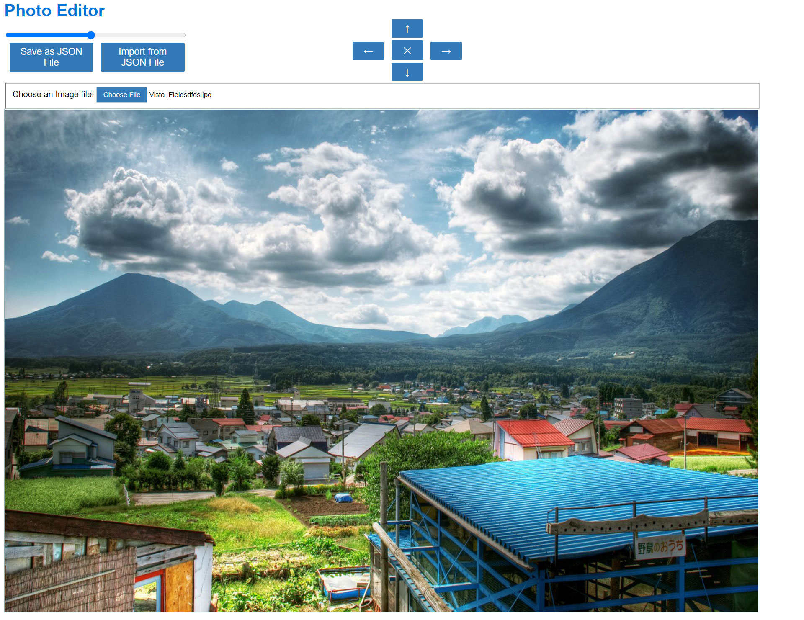

# PhotoEditor

Photo Editor developed using JavaScript and SASS.

## Demo Snapshots

# `Home/Dashboard Page`

## System requirements

In order to build the project you will need Install Node Js on your machine [Node.js](https://nodejs.org/en/)

Install Pre-req Packages:

`npm install`

To Start App Server:

`npm start`

To Visit App Via Browser:

`http://localhost:8090`
